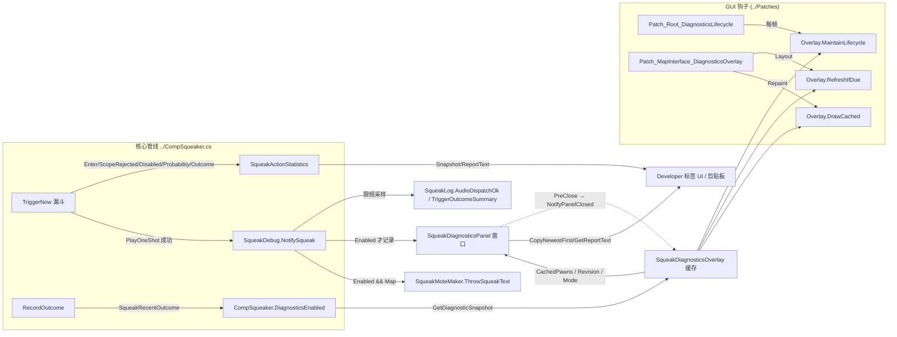

# Source/SqueakyRatkin/Debug/

本目录是 Squeaky Ratkin 的全部**诊断与开发者工具**：游戏内 overlay、DebugAction 菜单、音频路径追踪、单 pawn 触发漏斗统计、mote 渲染与音频浏览工作台。它们只观察/驱动核心触发管线，不参与产品语义决策（产品逻辑在 `../CompSqueaker.cs` 等核心文件）。

## Responsibility

- 暴露调试入口：LudeonTK `[DebugAction]` 菜单项（[SqueakDebugActions.cs](SqueakDebugActions.cs)）与设置页 Developer 标签（`../UI/SqueakyRatkinSettings.DiagnosticsUI.cs`）共用同一批底层存储。
- 运行时诊断 overlay：低频率、Layout/Repaint 分离的 pawn 状态快照；pawn 头上只画单字符标记（●），完整详情进可拖动诊断面板（[SqueakDiagnosticsOverlay.cs](SqueakDiagnosticsOverlay.cs)、[SqueakDiagnosticsPanel.cs](SqueakDiagnosticsPanel.cs)）。
- 音频路径诊断：成功派发（PlayOneShot 之后）的环形缓冲记录、格式化报告与派发 mote（[SqueakAudioPathDiagnostics.cs](SqueakAudioPathDiagnostics.cs)、[SqueakMoteMaker.cs](SqueakMoteMaker.cs)）。
- 触发漏斗统计：单 pawn 会话内每个 `SqueakAction` 的拒绝/通过计数（[SqueakActionStatistics.cs](SqueakActionStatistics.cs)）。
- 音频资产浏览器（Animal Voice Workbench）：反射枚举动物 def 的全部 SoundDef 引用、解析 clip、试听、导出样本 trace（[SqueakAudioBrowser.cs](SqueakAudioBrowser.cs)）。
- 详细日志的音频派发采样与汇总（[SqueakDebug.cs](SqueakDebug.cs)）。

## Key Files/Symbols

| 文件 | 关键符号 | 职责 |
|---|---|---|
| [SqueakDebug.cs](SqueakDebug.cs) | `SqueakDebug` | 中枢门面：`ShowOverlay`/`AudioPathDiagnosticsEnabled` 别名 → `SqueakAudioPathDiagnostics.Enabled`；`ShowCameraIndicator`；`NotifySqueak`（派发成功回调，唯一生产→诊断入口）；`ResetLoggingSession`；详细日志 5s/动作明细 + 60s 汇总采样 |
| [SqueakAudioPathDiagnostics.cs](SqueakAudioPathDiagnostics.cs) | `SqueakAudioPathDiagnostics`、`Record` | 容量 10 环形缓冲；`Enabled` 开关（rev 递增）；`RecordDispatched`（internal）；快照 `GetSnapshot`/`CopyNewestFirst`/`Last`；报告 `GetReportText`/`GetLastReportText`/`GetHumanDetail`（`sraudio fmt=1`） |
| [SqueakActionStatistics.cs](SqueakActionStatistics.cs) | `SqueakActionStatistics`、`Counters`、`ActionSnapshot`、`Snapshot` | 单 pawn 漏斗计数（15 个 counter + ExpectedProbability 累加）；`Start`/`Stop`/`Reset`/`GetSnapshot`/`GetReportText`（`srstat fmt=1`）；internal 埋点 `Enter`/`ScopeRejected`/`Disabled`/`Probability`/`Outcome`；自动失效停止 |
| [SqueakDiagnosticsOverlay.cs](SqueakDiagnosticsOverlay.cs) | `SqueakDiagnosticsOverlay`、`SqueakDiagnosticsMode`、`CachedPawn` | Overlay 会话生命周期、结构化快照缓存（`CachedPawns`/`Revision`/`SelectedPawn`/`Mode`/`ReadyFor`）与单字符标记绘制；`SetMode`/`MaintainLifecycle`/`RefreshIfDue`/`DrawCached`；面板开闭联动（`NotifyPanelClosed`） |
| [SqueakDiagnosticsPanel.cs](SqueakDiagnosticsPanel.cs) | `SqueakDiagnosticsPanel : Window` | 可拖动诊断面板（纵向 400×560）：Selected 单 pawn 分节详情（Field 两列网格，label 45/55，长值字段如 Outcome 用 30/70 全宽换行自适应行高行，标题/分节行高测量自适应，无滚动条、窗口高度按 Selected 内容自适应（只增不减））/ Visible ≤16 行列表，SR 风格（复用 `SqueakySettingsUI` token 与格式化函数）；Repaint 仅在 `Revision` 变化时重建格式化缓存；窗口属性：`forcePause=false`/`absorbInputAroundWindow=false`/`preventCameraMotion=false`/`draggable=true`/`closeOnCancel=false`（Esc 双击 armed 3s 关闭，`WindowOnGUI` 边缘 clamp 保证标题条 24px 可抓回）；关闭（X 或连按 Esc）→ `NotifyPanelClosed` → `SetMode(Off)` |
| [SqueakDebugActions.cs](SqueakDebugActions.cs) | `SqueakDebugActions` | 13 个 `[DebugAction("Squeaky Ratkin", …)]` 菜单项；兼容别名 `OverlayOn`/`OverlayOff` |
| [SqueakMoteMaker.cs](SqueakMoteMaker.cs) | `SqueakMoteMaker`、`MoteTextWithBackground`、`SqueakMoteOffset : DefModExtension` | 派发提示 mote：描边文字绘制 + 可配置偏移（读 `SR_Mote_TextBg` def 的 modExtensions，改 def 即可调位置，无需重编译） |
| [SqueakAudioBrowser.cs](SqueakAudioBrowser.cs) | `SqueakAudioBrowser`、`Dialog_SqueakAudioBrowser : Window` | 工作台对话框：`BuildIndex`（反射收集引用）→ 筛选 → `Resolve`（`SqueakSoundAvailabilityCache`）→ `Audition`（on-camera 适配试听）→ `CopyTrace`（`SR.AnimalVoiceSample.v1` 剪贴板导出） |

## Design

### 四层门控（不可混淆）
1. **DevMode**（`Prefs.DevMode`，RimWorld 自身开发者模式）：DebugAction 菜单可见性由 LudeonTK 属性决定；overlay `SetMode(Selected/Visible)`、相机指示器绘制、`Patch_GlobalControlsUtility_CameraIndicator` 均要求它为 true。这是游戏级门。
2. **developerToolsEnabled**（`SqueakyRatkinSettings` 持久化字段，设置页版本标签连点 7 次解锁）：打开 Developer 标签；统计/音频路径相关的 DebugAction 全部要求它为 true 才执行。相机指示器与 overlay 诊断的 DebugAction 反而**不**检查它（只依赖 DevMode）——改动作时注意这一不一致。
3. **详细日志**（`SqueakLog.EffectiveDevLogging`，`devLoggingMode = Auto/Enabled/Disabled`）：只控制 `SqueakLog` 事件是否发出（`AudioDispatchOk`、`TriggerOutcomeSummary`、`OverlayChanged`、`CameraChanged` 等 DevOnly 事件）以及 `SqueakDebug.NotifyAudioDispatched` 的限频采样。**不影响 mote**。
4. **音频路径诊断开关**（`SqueakAudioPathDiagnostics.Enabled`）：同时控制环形缓冲记录（`RecordDispatched` 内部早退）与派发 mote（`SqueakDebug.NotifySqueak` 中 `AudioPathDiagnosticsEnabled && pawn?.Map != null`）。与详细日志相互独立（`SqueakDebug.NotifySqueak` 注释明确此边界）。

### 性能契约
Overlay 严格遵守 Unity GUI 事件分离：**Layout 才做**快照、扫描（`RefreshIfDue`）；**Repaint 只画**缓存的单字符标记（`DrawCached`），不做任何快照/格式化工作。Refresh 频率：Selected 0.25s、Visible 0.5s、最多 16 个 pawn；离屏/死亡/换地图的 pawn 会被移出缓存并调用 `CompSqueaker.ResetDiagnosticState()`。同文件注释明示 `MaintainLifecycle` 不得含快照/格式化/翻译/扫描/绘制。诊断面板 `DoWindowContents` 每帧执行但**不**每帧 GetDiagnosticSnapshot/重排版：仅在 `SqueakDiagnosticsOverlay.Revision`（或 mode）变化时于 Repaint 重建格式化缓存，其余帧只画缓存文本。

### 快照与缓存模式
- 三个存储（stats、audio path、overlay）都采用 **revision 递增 + 不可变快照**：overlay 的 `Revision` 在条目实际更新（`RefreshSnapshot`）或移除（`RemoveUnrefreshedPawns`）时递增；面板按 `Revision` 比较后重建显示缓存，UI 侧（`../UI/SqueakyRatkinSettings.DiagnosticsUI.cs`）在 Repaint 中按 `Revision` + 时间桶比较后重建显示缓存（`statisticsSnapshotCache`、`audioRecordCache` 等），避免每帧重建。
- overlay 缓存条目是结构化快照（`CachedPawn` 持有 `SqueakDiagnosticSnapshot` + 标记字符串/颜色），不存多行文本；标记颜色与面板 Ready/Blocked 共用 `ReadyFor` 单一就绪规则（绿= `SqueakySettingsUI.Success`，金= `SqueakySettingsUI.Gold`）。
- 环形缓冲写入是唯一可变点（`records[next]`、`next/count`），快照方法只读拷贝。
- 报告格式是外部契约：`sraudio fmt=1`、`srstat fmt=1`、`srdiag fmt=1`（SqueakLog）、剪贴板 `schema=SR.AnimalVoiceSample.v1`——不要破坏键名。

### 音频浏览器
反射索引（`WalkOwner`，深度 ≤ 2，只递归 `Verse*` 命名空间的非集合实例字段）收集 ThingDef/race/lifeStageAges 上的 `SoundDef` 字段，按字段名做语义分类（Vocal: Call/Angry/Wounded/Death/Ambience/Attack/Eating/Moving；Mechanical: Pickup/Drop/Melee/Bullet/Impact；其余 Other），按 `fieldPath|defName` 去重。试听路径：`SqueakOnCameraPreviewAdapter.Get()`（取 `SR_Call_Preview` def 的第一个 `onCamera` subSound）→ `SoundInfo.OnCamera()` + `testPlay` → `SampleOneShot.TryMakeAndPlay`，pitch = 工作台滑块 × 规范 mood mod 的 `pitchJitter` 随机值（`Rand.PushState/PopState` 包裹）。解析结果按 SoundDef 缓存于 `SqueakSoundAvailabilityCache`（一次性、绝不枚举文件）。

## Data & Control Flow

1. **触发漏斗埋点**（方向：CompSqueaker → Debug）：`SqueakActionStatistics` 只在 `IsRecording`（会话 pawn 且地图/上下文有效）时计数；`Validate` 在 pawn 离图或游戏上下文不可用时自动 `Stop("pawn_or_map_invalid"|"game_context_unavailable")`。统计**不做**任何产品级副作用（无 Scribe、无自动日志）。
2. **派发成功**（方向：生产 → Debug，`CompSqueaker.cs` `PlayOneShot` 后）：`SqueakDebug.NotifySqueak` 依次做详细日志限频采样（5s 明细/动作、60s 汇总）、`SqueakAudioPathDiagnostics.RecordDispatched`（pack 来源经 `../SqueakXenotypeCatalog.cs` 的 `PackByKey` 解析；tick/realtime 经 `../SqueakSettingsGameContext.cs` 的 `CaptureRuntime()`）、以及启用开关时的 mote。
3. **Overlay 会话**：`SetMode`（来自 DebugAction）校验 `HookAvailable && Prefs.DevMode && Find.CurrentMap != null` 后置 `CompSqueaker.DiagnosticsEnabled = true` 并打开诊断面板；`RefreshIfDue` 每轮先 `MaintainLifecycle`（换图/退出 DevMode 即清会话并复位 `DiagnosticsEnabled`），随后维护 `SqueakPeriodicPopulation`（`CompSqueaker.MaintainPeriodicPopulationDiagnostics`，保证缩放数据在禁用产品缩放时仍新鲜）并刷新结构化快照与标记（绿=`SqueakySettingsUI.Success`=计时就绪+动作启用+发声效率>静默阈值，金=`SqueakySettingsUI.Gold`=其余）；`DrawCached` 按相机视口裁剪后 `GenMapUI.DrawText` 画单字符 `●`（4 方向黑描边增强可见性，Tiny 字体锁定不可改大小）。面板关闭（X，或 3s 内连续两次 Esc；Esc 双击有 `SR.Diagnostics.Panel.CloseHint` 提示条）→ `NotifyPanelClosed` → 整会话拆除；`SetMode(Off)`/`ClearSession` 也会先关面板。
4. **浏览器**：`Open()`（Developer 标签按钮）→ 构造时 `BuildIndex` → 选择动物/引用 → `Resolve`（只对显式解析过的 SoundDef 显示 clip，`VisibleClips` 查缓存）→ 试听/复制。`Open()` 全程 try/catch，失败走 `SqueakLog.WorkbenchOpenFailed`。

## Integration

- **`../CompSqueaker.cs`**：唯一生产侧消费者/供给者。消费 `SqueakActionStatistics.*` 埋点与 `SqueakDebug.NotifySqueak`；提供 `DiagnosticsEnabled`（静态）、`GetDiagnosticSnapshot()`（只读快照，不消耗 Rand/不更新时间戳）、`ResetDiagnosticState()`、`MaintainPeriodicPopulationDiagnostics()`、`SqueakDiagnosticSnapshot` 结构。
- **`../Patches/`**：`Patch_MapInterface_DiagnosticsOverlay`（Layout/Repaint 钩子 + `HookAvailable`，Hook 不可用时 `Prepare` 返回 false 优雅跳过，overlay 拒绝启动并记录一次 `DiagnosticsStartFailed`）；`Patch_Root_DiagnosticsLifecycle`（每帧清理）；`Patch_GlobalControlsUtility_CameraIndicator`（DevMode + `ShowCameraIndicator` 时画相机高度/视野）；`Patch_DebugTabMenu_Actions`（`localizeDebugActions` 开启时翻译 `DebugAction_<方法名>`/`DebugActionCategory_<类目>` 键，切换时重置 `Dialog_Debug` 缓存）。
- **`../SqueakyRatkinSettings.cs`**：持有 `developerToolsEnabled`/`devLoggingMode`/`localizeDebugActions`；`DisableDeveloperToolsNow()` 会停统计并置 `SqueakAudioPathDiagnostics.Enabled = false`；详细日志模式变化时调 `SqueakDebug.ResetLoggingSession()`。
- **`../UI/SqueakyRatkinSettings.DiagnosticsUI.cs`**：Developer 标签的统计面板、音频路径面板、浏览器按钮、禁用按钮——与 `SqueakActionStatistics`/`SqueakAudioPathDiagnostics` 同源，靠 Revision 缓存。
- **`../UI/SqueakyRatkinSettings.SoundMoodUI.cs`**：`SqueakOnCameraPreviewAdapter`（`SR_Call_Preview`）与规范 mood mod（`GetCanonicalMoodMod`）供浏览器试听。
- **`../SqueakSoundAvailability.cs`**：`SqueakSoundAvailabilityCache.Resolve/PeekState/TryGetCached`、`SqueakResolvedClip` 供浏览器解析与详情。
- **`../Logging/SqueakLog.cs`**：唯一日志出口（`ShouldEmitDev`/`EffectiveDevLogging` 门控；DevOnly 事件在未开启详细日志时直接丢弃）。
- **`../UI/SqueakySettingsUI.cs`**：浏览器/设置页共用控件（PanelFrame、SearchField、FilterChip、HelpIndicator、Button、StatusPanel、EllipsizedLabel 等）。

## Change Guidance

- **新增调试动作**：优先走既有存储（revision + 快照 + Repaint 缓存），不要自建 UI 状态；确认动作该受哪层门控（devTools 设置 vs 纯 DevMode），并在 [SqueakDebugActions.cs](SqueakDebugActions.cs) 的既有模式内保持一致。
- **新增统计计数**：单文件贯通 `Counters` 结构 → `ActionSnapshot` → `Outcome` switch → `GetReportText` 格式串，缺一处即漂移；埋点必须保持 internal 且仅由 `CompSqueaker` 漏斗调用。
- **Overlay 性能红线**：Repaint 路径（`DrawCached`、`MaintainLifecycle`）严禁快照/翻译/格式化/扫描；面板每帧只画缓存、重建严格按 `Revision` 门控；新字段加入 `SqueakDiagnosticSnapshot` 后同步面板（`SqueakDiagnosticsPanel.RebuildSelected`/`RebuildVisible`）与 `SR.Diagnostics.Panel.*` 翻译键。
- **mote 位置调整**：改 `Defs/MoteDefs/SR_Mote.xml` 的 `SqueakMoteOffset` modExtensions（默认 offsetY=0.8），无需重编译；`SR_Mote_TextBg` 缺失时 `ThrowSqueakText` 静默返回，勿改此行为为抛错。
- **兼容边界**：`OverlayOn/OverlayOff` 是旧反射调用方别名，勿删；`HookAvailable` 为 false 的旧版游戏上 overlay 必须优雅降级（SetMode 不启动、只记一次日志）；报告/剪贴板格式（`sraudio`/`srstat`/`SR.AnimalVoiceSample.v1`）视为对外契约，键值变更需同步下游解析方。
- **门控改动**：修改任一动作的门控时，必须同时核对四层门控语义（DevMode / developerToolsEnabled / EffectiveDevLogging / `AudioPathDiagnostics.Enabled`），并保持「详细日志不影响 mote、音频路径开关不影响日志采样」的既有独立性。
