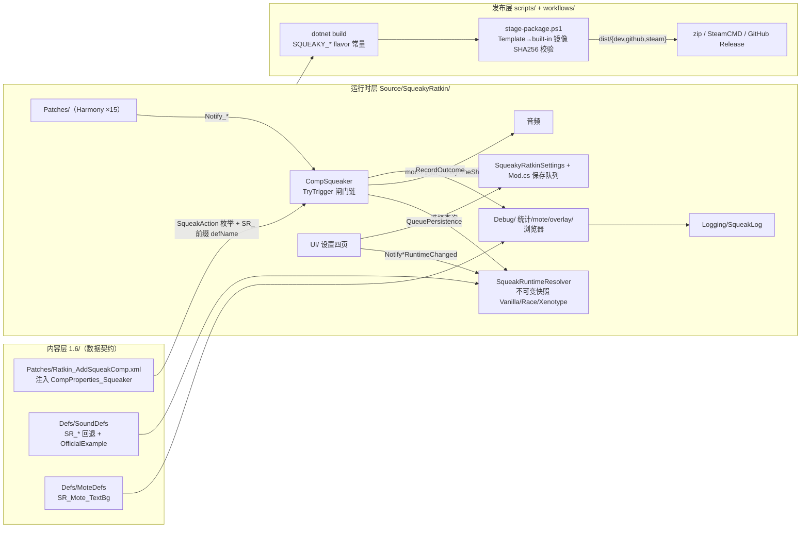

# squeaky_ratkin/ — 根地图（Repository Atlas）

> 全部 13 张子目录 codemap 的聚合入口。子图按目录就近存放（`<目录>/codemap.md`），本图只做职责汇总、跨层数据流与导航，不复制子图实现细节；子图内容以各自文件为准。
> 核验时间：2026-08-13（13 张子图全部已读）。

## Project Responsibility

**鼠辈啁啾 / Squeaky Ratkin** 是 RimWorld 1.6 语音发声模组：为 HAR 体系的 Ratkin 种族（`AlienRace.ThingDef_AlienRace[defName="Ratkin"]`，def 由 NewRatkinPlus 提供）挂载每 pawn 的发声组件，按 15 个 `SqueakAction`（Eat / Call / Move / Sleep / Social / Joy / Work / Wounded / Select / Death / Draft / Undraft / Attack / Equip / MentalBreak）触发音效，支持心情调制（mood pitch/volume/jitter）、距离预设、VoicePack 分层选音（Vanilla 回退 / Race / Xenotype）、设置工作台、诊断工具与结构化日志。

- **身份**：packageId `coahuilite.squeakyratkin`（大小写敏感，Extras 内嵌包依赖此 ID）；产品版本 `0.2.2`（dev 进行中，`0.2.1` 为最新已发布）；`supportedVersions` 仅 1.6。
- **依赖分层**：Harmony（`brrainz.harmony`）与 HAR（`erdelf.HumanoidAlienRaces`）为硬依赖（`modDependencies`）；NewRatkinPlus（`Solaris.RatkinRaceMod`）运行时必需但元数据仅 `loadAfter` 软声明；`LoadFolders.xml` 无条件加载本体，发声注入按 XPath `defName="Ratkin"` 匹配（缺 def 时静默 no-op，兼容保留该 def 的 fork）；全部官方 DLC 与 HugsLib **零引用**（No-DLC 契约：Biotech 增强全部经 `ModsConfig.BiotechActive` 门控，HAR 交互全反射）。
- **配置三层**：XML 默认（`1.6/Patches`）← 玩家 ModSettings override（`SqueakyRatkinSettings`）← 运行时发布（resolver/policy 不可变快照）。
- **发布形态**：Dev / GitHub / Steam 三种 build flavor 的 mod 包，统一由 `scripts/stage-package.ps1` 组装。

## System Entry Points

| 入口 | 位置 | 说明 |
|---|---|---|
| 游戏加载 | `About/About.xml` + 根 `LoadFolders.xml` | `ModLister` 读元数据 → 依赖校验/排序 → `InitLoadFolders` 无条件挂 `[1.6, /]`（1.6 优先）→ 载入 `1.6/` 的 Patches / Defs / Assemblies / Languages |
| C# 装配点 | `Source/SqueakyRatkin/Mod.cs`（`SqueakyRatkinMod` ctor） | 唯一 Mod 入口：`Harmony.PatchAll()`（id `coahuilite.squeakyratkin`）→ `ExecuteWhenFinished` 启动链（resolver 主线程初始化、catalog 刷新、设置应用、迁移 flush） |
| Harmony 事件转译 | `Source/SqueakyRatkin/Patches/` | 15 个 patch：伤害/攻击/死亡/选中/整编/装备/精神崩溃/周期成员/诊断生命周期/设置窗口关闭等 → `CompSqueaker.Notify_*` 等下游 |
| 调试入口 | `Debug/` + `[DebugAction]` 菜单 | overlay（单字符标记 + 可拖动诊断面板）、音频路径环形缓冲、触发漏斗统计、音频浏览工作台；四层门控（DevMode / `developerToolsEnabled` / `EffectiveDevLogging` / `AudioPathDiagnostics.Enabled`） |
| 日志出口 | `Logging/SqueakLog.cs` + `Logging/SqueakLogProtocol.cs` | 唯一 closed typed facade（27 事件方法/30 EventId：28 v1 字节不变 + 2 v2 扩展）+ internal registry/once/formatter/sink + `srdiag fmt=1`/`fmt=2` → Verse `Log`；`tools/SqueakLogCharacterization` 锁协议 |
| 构建/打包 | `scripts/pack-*.ps1` + `.github/workflows/` | `dotnet build -p:SqueakyBuildFlavor=<F>` → `stage-package.ps1` → `dist/<flavor>/` |

## Architecture / Data Flow

跨层流要点（细节见各子图）：

1. **XML/patch → Comp/runtime**：`1.6/Patches` 在加载期把 `CompProperties_Squeaker` 注入 Ratkin.comps；XML 与 C# 之间的兼容边界是 `SqueakAction` 枚举（15 值，append-only，序数稳定）与 `SR_` 前缀 defName 契约（`SqueakActionDefinitions.AudioKey` = `"SR_" + 动作名`）。新增动作必须三处同步：枚举 + `AudioKey` + `SR_<Action>` SoundDef，再补运行时 hook。
2. **触发 → 选音 → 播放**：Harmony patch 转译为 `CompSqueaker.Notify_*` / `CompTick` → 闸门链（spawned + CurrentMap + 视口 + plan.Configured）→ 全局作用域 `SqueakGlobalActionPolicy` → 快照上下文 → 周期人口缩放 → 时序模型 → 概率/vocal 门 → `ChooseProductionSound`（Off=仅 Vanilla；Fallback/Remix=层内 `HasPlayable` 过滤后随机）→ mood 调制后 `PlayOneShot`。失败路径全部 `RecordOutcome` + 统计埋点。
3. **设置 → 运行时**：UI 只表达意图，canonical 写入在 `SqueakyRatkinSettings`；经 `Notify*RuntimeChanged` 发布（cheap=静态字段、continuous=75/150 ms 防抖、discrete=立即），resolver 主线程单发布者发布不可变快照；磁盘写入只走 `base.WriteSettings()`（Mod 层 generation + 350 ms 防抖合并）。
4. **诊断/日志**：`Debug/` 只观察不决策（revision + 不可变快照 + Layout/Repaint 分离）；所有失败/边界事件经 `Logging/SqueakLog` 枚举化出口（once 去重 + `srdiag fmt=1` 机器字段）。
5. **build → stage → channel**：`SqueakyBuildFlavor` 决定 `SQUEAKY_DEV/GITHUB/STEAM` 常量（运行时 `BuildIdentity`、dev 日志默认、dev-only 设置项）；`stage-package.ps1` 是唯一 staging 引擎（断言 DLL 存在、Template→built-in 音频实际键集合与 SHA256 镜像、删除 `PublishedFileId.txt`/`*.pdb`/`*.gitkeep`）；csproj `<Version>` 是全部 flavor 的单一事实来源（release tag 基版本强制一致）。

## Repository Directory Map

所有子图均为「Responsibility / Key Files / Design / Data & Control Flow / Integration / Change Guidance」六段结构，逐级下钻即可。

| 目录 | 子图 | 一句话职责 |
|---|---|---|
| `About/` | [About/codemap.md](About/codemap.md) | mod 元数据与发布边界：`About.xml`（packageId、依赖分层、仅支持 1.6）、商店图标；本地图同时覆盖根 `LoadFolders.xml` 与 `.github/workflows/`（CI/Release 流水线） |
| `1.6/` | [1.6/codemap.md](1.6/codemap.md) | 1.6 内容包：加载期 comp 注入 + 全部发声/浮字 Def + 随包 DLL + 本地化；无条件加载，发声注入按 XPath `defName="Ratkin"` 匹配 |
| `1.6/Defs/` | [1.6/Defs/codemap.md](1.6/Defs/codemap.md) | 纯 XML Def 契约层（无 C# 编译依赖）：SoundDefs 与 MoteDefs 两个子域的入口 |
| `1.6/Defs/SoundDefs/` | [1.6/Defs/SoundDefs/codemap.md](1.6/Defs/SoundDefs/codemap.md) | 两层音池：15 个 `SR_<Action>` Vanilla 回退 SoundDef + `SR_Call_Preview` 试听 transport + `SR_OfficialExample_Race` 官方 Example VoicePack（音频打包时注入） |
| `1.6/Defs/MoteDefs/` | [1.6/Defs/MoteDefs/codemap.md](1.6/Defs/MoteDefs/codemap.md) | 唯一调试浮字 `SR_Mote_TextBg`（`MoteTextWithBackground` + `SqueakMoteOffset` 偏移），仅 Debug 子系统消费 |
| `1.6/Patches/` | [1.6/Patches/codemap.md](1.6/Patches/codemap.md) | 加载期补丁：向 Ratkin.comps 注入 `CompProperties_Squeaker`（15 action 触发配置 + 4 moodMods + 3 distancePresets，全数据驱动） |
| `Source/` | [Source/codemap.md](Source/codemap.md) | C# 运行时源码根：装配边界与入口；实质内容在 `Source/SqueakyRatkin/`（见下） |
| `Source/SqueakyRatkin/` | [Source/SqueakyRatkin/codemap.md](Source/SqueakyRatkin/codemap.md) | 运行时核心与单一装配点：Mod 生命周期、`CompSqueaker` 触发/播放、resolver/catalog/policy 不可变快照发布、周期人口缩放、全部持久化数据模型 |
| `Source/SqueakyRatkin/Patches/` | [Source/SqueakyRatkin/Patches/codemap.md](Source/SqueakyRatkin/Patches/codemap.md) | Harmony 集成层（15 patch）：RimWorld 事件 → `CompSqueaker.Notify_*` / 周期成员 / 诊断生命周期 / 设置窗口关闭；patch 薄、业务判断在 Comp |
| `Source/SqueakyRatkin/UI/` | [Source/SqueakyRatkin/UI/codemap.md](Source/SqueakyRatkin/UI/codemap.md) | 设置工作台 composition layer：四页 UI、局部编辑缓冲（draft）、诊断面板与音频浏览入口；不拥有业务写入与保存协调 |
| `Source/SqueakyRatkin/Debug/` | [Source/SqueakyRatkin/Debug/codemap.md](Source/SqueakyRatkin/Debug/codemap.md) | 诊断与开发者工具：overlay、DebugAction 菜单、音频路径追踪、触发漏斗统计、mote、音频浏览工作台（四层门控） |
| `Source/SqueakyRatkin/Logging/` | [Source/SqueakyRatkin/Logging/codemap.md](Source/SqueakyRatkin/Logging/codemap.md) | 唯一日志出口：public `SqueakLog` facade（27 事件方法/30 EventId）与 internal `SqueakLogProtocol`（registry/once/formatter/sink）；双 flavor characterization 锁 v1 字节 + v2 分支 |
| `scripts/` | [scripts/codemap.md](scripts/codemap.md) | 构建/打包流水线：`stage-package.ps1` 唯一 staging 引擎 + dev/github/steam 三个 flavor 包装脚本；守护 Template→built-in 音频镜像、版本纪律与发布包边界。 |

相邻但无独立子图：`Extras/SqueakyRatkinExampleVoices/`（随包分发的独立示例包，Template 音频唯一维护源）、`docs/`（权威合同与内部规划笔记，见 Navigation Rules）、`1.6/Languages/`（本地化）、`1.6/Assemblies/` 与 `dist/`（gitignored 构建态）。

## Current Change Surface

**权威状态**：[`TODO.md`](TODO.md)（0.2.2 代码卫生与可读化 / 独立 Kiiro 实验 / 0.3.x 内部通用化筹备）与 [`MEMORY.md`](MEMORY.md)（耐久状态、权威入口、工程决定与交接）。当前 0.2.2 的先决卫生工作：全库梳理已完成；`tools/SqueakLogCharacterization` 已锁 28-event `srdiag v1` 协议；`SqueakLog` 已从 registry/once/formatter/sink 机械拆分，public facade 与日志行为不变。0.3.x 设计笔记已落地；其余事项见 TODO。

明确延后：仅 `TicksAbs` 再现时调查归因。Kiiro 实验仍在 `kiiro-experiment` 分支，不入 0.2.2；D（Biotech 异种域）、通用化后再议的 merge、实验完整复盘均挂起。任何内容契约改动（音频数量/版本/依赖）必须同步 `scripts/stage-package.ps1` 校验表。

## Navigation Rules

1. **先根后子**：从本图按目录定位子图，沿六段结构（Responsibility / Key Files / Design / Data & Control Flow / Integration / Change Guidance）逐级下钻；子图之间以相对链接互引（如 `1.6/` → `Source/SqueakyRatkin/` → `Debug/` `Logging/` `UI/` `Patches/`）。
2. **权威合同与规划**：现行合同（`docs/project-architecture-contract.md`、`settings-ui-product-contract-zh.md`、`logging-protocol.md`、`voice-pack-author-guide-zh.md`、`steam-workshop-page-copy-draft.md`、`release-runbook-zh.md`、`release_review/`）定义当前行为；[`docs/internal-universalization-design-note-zh.md`](docs/internal-universalization-design-note-zh.md) 仅是 0.3.x 内部规划输入，不覆盖合同。根图不重复这些文档内容。
3. **契约红线**（跨子图共享，改动前必读对应子图 Change Guidance）：No-DLC/HugsLib 零引用；`SR_` 前缀 defName；`SqueakAction` 枚举 append-only（新增动作三处同步：枚举 + `SqueakActionDefinitions.AudioKey` + `SR_<Action>` SoundDef，再补运行时 hook）；`packageId` 大小写敏感；Template↔built-in 音频实际键集合与 SHA256 镜像一致；csproj `<Version>` 与 git tag 基版本一致；`srdiag fmt=1` 字段顺序与 28 个事件 ID 为兼容面（v1 字节不变）；v2 扩展事件（`settings.origin`/`audio.route.selected`）走 `fmt=2` 与 `log-v2` once 域，extension-only。
4. **状态所有权**：`dist/`、`1.6/Assemblies/`、staged `1.6/Sounds/` 为构建态（gitignored，脚本全权管理）；仓库维护态为 `About/`、`1.6/`（除 Assemblies）、`Extras/`、`Source/`。
5. **本图维护约定**：本图是纯汇总层（不复制子图实现细节）；子图更新后只同步「Directory Map」一行、相关入口与红线即可。`AGENTS.md` 不在本图管辖内（其更新需用户另行确认），本图不注册、不引用它。
