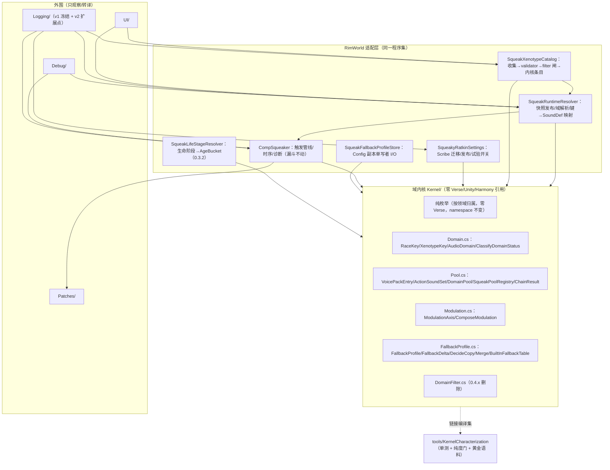

# 0.3.x 重构架构决策（已接受）

> 状态：**已接受的 0.3.x 实现架构**，是 [`internal-universalization-design-note-zh.md`](./internal-universalization-design-note-zh.md)（规划输入，仍有效）到现行合同之间的实现设计。实施前必须将受影响结论提升进 `project-architecture-contract.md` 与设置合同；本文件不与任何合同冲突，冲突时合同优先并需按流程解决。
> 决策日期：2026-08-18 · 决策分支：`0.3.x`（自 dev 切出，隔离 0.2 线）· 输入：四份并行架构草稿（见 §2）。

## 1. 决策摘要

**采纳「内核但薄」（Kernel-But-Thin）：把 0.3.x 新增的决策逻辑（域键、带权公平池、年龄过滤、五级选择链、fallback 合并决策、调制合成、DomainFilter 谓词）抽成零 Verse 引用的内核编译集（`Source/SqueakyRatkin/Kernel/` + 按领域归属的纯枚举文件），由 `tools/KernelCharacterization` 控制台工程链接编译强制纯度并持有全部单测与黄金语料；不建独立程序集。** `CompSqueaker`、resolver、catalog 收缩为 RimWorld 侧适配层；版本限制（`ProductDomainFilter`）以数据闸门形式只存在于适配层，内核在结构上无法表达"限制域"。

一句话权衡：0.3.x 阶段门是"选择语义正确性门"（per-race 池、fallback、静音、年龄），游戏内验证慢、抖、不可复现；约 500 行内核 + 200 行 harness 把验收证据变成确定性单测与可回放语料。不拆内核技术上也做得了，但阶段门证据质量是真实瓶颈。

**术语口径**：本文"ABI/兼容面" = 五类持久化/共享格式——① Scribe 设置格式（`SqueakyRatkinSettings` 字段与记录 schema）；② srdiag 日志协议（事件 ID/字段序/格式串）；③ VoicePack XML 包 schema；④ 枚举序列化值（`SqueakAction` 序数）；⑤ Def 键（`SR_*` SoundDef 与 PackKey）。"定型" = 0.x 内部冻结（0.4.x US 发布前可修正，代价=内部返工）；"冻结" = 已发布契约（修正须版本化兼容）。

### 1.1 0.x 破坏性窗口定位（2026-08-18 口径修正）

**1.0.0 = 承诺不可破坏性变更的起点；0.x（含 0.3.x/0.4.x）= 最后允许大破坏性改动的窗口。** 本设计据此利用窗口做大结构改动（Kernel/ 抽取、域模型、17 动作、链重写），不在 0.x 把结构绑死。

**真实硬约束只有两类（即使 0.x 也须迁移兼容，因已发布/已有用户）**：
1. 玩家数据：已保存设置/存档 → Scribe 事务迁移（schema bump + 幂等）；卸载安全 = 存档零写入（永不破坏存档）。
2. 已发布面：srdiag v1 协议（28 事件/字段序/once key，已随 0.2.x 发布并被 characterization 锁定，扩展走 v2 版本化）；`SR_*` SoundDef 键与 PackKey（已发布包的引用面）。

**其余一切在 0.x 可大胆改**：内部结构、域模型、动作清单（append-only 序数不变但可增）、未公开的 XML 字段。改错成本 = 修正本身，不构成违约。

**"冻结"口径修正**：0.3.2 的"ABI 冻结"是**内部定型点**（生态准备：让第三方包自 US 拆分发布起有稳定依赖面），**不是 1.0.0 前的唯一窗口**；作者指南锁定"US 拆分前不公开 profile schema"，故 0.3.2 后至 US 发布前无第三方依赖，0.x 破坏窗口实际延伸到 **US 拆分发布（0.4.x 首版）**；1.0.0 = 官方宣告"往后不再破坏"。

## 2. 方案比拼记录（四稿并行，2026-08-18）

| 方案 | 核心思想 | 强项 | 弱点 | 裁决 |
| --- | --- | --- | --- | --- |
| A 内核但薄（采纳） | 决策逻辑进零依赖内核编译集，harness 强制纯度；单 csproj 管线零扰动 | 阶段门证据确定性；迁移锚点；0.4.x 内核文件夹搬出即 US 本体 | 内核纪律负担；0.3.0 一波机械 churn；双份表示心智成本 | **主体采纳** |
| B 契约先行分层（CF-3） | 三 internal 契约（装配/路由/持久化），各两个真实消费者 | production/preview 共用路由；双工件持久化有明确 owner；迁移事务性细 | 单实现接口维护成本（自认）；认知负担 | 不采纳形态；**吸收三项硬细节**（见 §2.1） |
| C 数据驱动极简 | 域全落数据面，CompSqueaker/patch/UI 外壳零改动 | diff 最小（~+1500/−600）；与现行架构同构 | 测试性最弱；0.3.1 等价验证回人工；0.4.x 无编译器强制边界 | 不采纳；其 YAGNI 立场已被 A 收敛版继承（TimingModel 原地、不拆程序集） |
| D 双内核渐进替换 | 影子内核对拍器 + 黄金语料，机器可复现等价 | 等价证据最强；0.3.0 生产零改动 | 双窗漂移风险与"单活路径"纪律张力最大；对拍器维护面 | 不采纳形态；**黄金语料升级吸收**（见 §2.1） |

### 2.1 吸收项（来自落选方案的硬细节）

1. **迁移事务性（B）**：Scribe 迁移先在临时 clone 上规范化/去重/校验，全部成功后才替换正式列表并 bump schema；失败保留原列表与旧 schema 并记日志。中断重启以旧 schema 幂等重跑，不半迁移。
2. **UI 泄漏点修复（B）**：`GetTargetCandidates` 只从 assembled `(race,xenotype)` 投影；当前实现把 canonical/har hint 泄漏 UI 的问题在 0.3.1 一并修复，HAR 发现仅 dev 诊断。
3. **BabyFits hook 源码核验（B，RimWorld 1.6 源码一手确认）**：`MentalFitGenerator.TickInterval` 最终成功调用 `MentalStateHandler.TryStartMentalState(item.mentalState, ..., transitionSilently: true)`。0.3.2 的窄 patch = `TryStartMentalState` 成功 postfix，仅当 `__result && stateDef` 属于经 `MentalFitDef` 反向映射表验证的 `MentalState_BabyCry`/`MentalState_BabyGiggle` 时通知新动作；No-DLC `Prepare=false`；不得扩大/替代 `MentalBreakWorker.TryStart` hook。
4. **黄金语料升级（D）**：0.3.0 黄金样本断言升级为全矩阵黄金语料（设置场景 × 15 action × 域 × 多种子统计直方图），冻结入库；0.3.1 切核后回放零 delta；0.3.2 加 Crying/Giggling 后扩为 17 action 矩阵并同提交重建。

### 2.2 动作门开放策略决策（2026-08-18，三方向并行比拼）

三份并行设计：**封闭（Apple 路线）/ 受控开放（Android 清单 + 技术化校验）/ 全面开放（Android 隐式 Intent）**。共同共识（无论哪条路都成立）：内置 17 枚举 ABI 不动；外部动作走命名空间字符串键（`packageId` 派生，伪造不可能）；`SqueakVoicePackAction.action` 字段类型枚举→string 但节点名不变（存量包零迁移）；触发 = 第三方自 patch 自事件调 SR 公开 API（无事件总线、SR 不 patch 第三方）；主线程断言 + 异常隔离（第三方不能经 SR 打崩游戏）；防刷屏底线（冷却下限 + vocal 门）；卸载 = DefDatabase 生命周期 + 既有 orphan/dormant 语义；恶意 mod 无解（可直调 `SoundDef.PlayOneShot`，诚实安全模型：SR 只保自身漏斗健康）。

**决策：受控开放为主形态，吸收封闭与全面开放的机制。**

| 要素 | 决策 |
| --- | --- |
| 动作表达 | 双轨字符串键：内置 = 枚举名（17 ABI 原样冻结，启动时隐式注册）；外部 = `SqueakActionDef` 注册（defName 语法校验、禁 `SR_` 前缀、键由真实 owner packageId 派生，词法隔离不可能碰撞）；Def 只带行为元数据（scope/冷却计划/vocal 策略），**不载音频**（音频留音频门） |
| 触发通路 | `SqueakCompat.NotifyAction(Pawn, string actionKey)` public 门面 → 既有 `NotifyExternal` 漏斗**全闸门复用**（policy/时序/冷却/vocal/池选择/调制，与内置同权），无 bypass；内置键从公开 API 拒绝（防双响）；External-only（无周期模式）+ `minIntervalTicks`≥60 硬下限 + 全局冷却不可豁免 = 防刷屏底线 |
| 校验治理 | 启动期确定性校验 fail-closed（语法/重复键剔除/元数据完整/冷却底线）；pack 引用侧：非法 error、内置未知 error、外部未注册 **dormant**（加载序无关，回归自动复活，跨 mod 配音是特性）；无人工审核（RimWorld 无商店），治理 = 技术校验 + 玩家代理 + 文档礼仪 |
| 玩家控制 | 两级：① pack 选择（细粒度授权，既有机制）；② **外部动作总闸 `allowExternalActions`（设置项，默认开）**——玩家一键静默全部外来动作。总闸在 `SqueakGlobalActionPolicy` 层实现（与内置全局作用域闸同位）：`GetScope(string key)` 对外部键先查总闸，关 → Disabled；只影响外部键，内置 17 动作与 pack 的内置音频零影响；关闭时外部触发走 `RecordOutcome`（ExternalBlocked）不裸 return；UI 设置页可见；srdiag v2 记开关状态/切换事件；0.4.x 随机制落地，`settingsSchemaVersion` additive 递增 |
| 卸载语义 | 零新机制：动作 mod 卸载 → 注册消失 → pack 选择走既有 orphan、配音包条目走既有 dormant；存档零写入 |
| 落地窗口 | **0.3.x 只做两件零成本事**：① srdiag v2 `action` 字段定型 = 字符串键（内置=枚举名，一次决策省 v3 协议）；② 内核动作键出生即字符串（见下）。机制本体（SqueakActionDef/Registry/Compat）**0.4.x US 拆分发布时与消费者同窗口落地**（作者指南同步公开）；0.3.x 建任何注册机制 = YAGNI 违反 |
| 放弃信号 | ① 0.3.x→0.4.x 无任何第三方表达动作扩展需求 → 退回封闭（第三方只做 VoicePack）；② 出现需人工仲裁的"标准键"诉求且无法承诺治理 → 转纯约定或封闭；③ 语料回放非零 delta（语义漂移实证）→ 撤销键迁移 |

**关键架构前置（本次决策对 0.3.x 内核的修正）**：Kernel/ 出生即使用**字符串动作键**（`ActionKey`）——内置动作经 `ActionKey.For(SqueakAction)` 单一映射点（适配层边界），`SqueakAction` 枚举保留于适配层设置/存档面（ABI 不动）。两个开放方案都要求最终字符串键；0.3.x 新建内核时直接采用 = 迁移成本归零，0.4.x 落地仅需新增 Def 注册与门面，无全表面重构。

**受控开放 = 八道闸门链**（每道独立可调，与既有"门禁分层"设计语言一致）：注册闸（fail-closed 校验）→ 所有权闸（键 packageId 派生）→ 线程闸（主线程断言+异常隔离）→ 触发闸（spawned/CurrentMap/视口，复用）→ 冷却闸（硬下限+全局冷却不可豁免）→ vocal 闸（复用）→ 玩家授权闸（pack 选择，细粒度）→ **玩家总闸**（`allowExternalActions`，粗粒度，见上表）。任何一道关闭都 fail-closed 静默，无 bypass 路径。

**三扇门协同**：外部动作音频 = 任意 VoicePack 按注册键声明（跨 mod 配音 dormant 语义）；内置 fallback 表封闭于内置键（维护者保底不开放）；外部动作无 pack = 无声（无 SR 兜底）。

### 2.3 路由核心公理 + 机械验证约束（2026-08-20 维护者确认）

**路由核心公理**：路由（域键/池/链形状/回退序/抽取）是系统核心；其余一切——触发闸门、时机、vocal、音频分配闸门、调制、诊断——是叠在路由上的执行层。执行层允许适度耦合，但须满足四条：

1. **链唯一事实源**：链形状/层级顺序/回退语义只有路由核心一个所有者；执行层不得旁路、重定义或部分复制链逻辑。
2. **依赖方向单向**：执行层 → 路由核心，禁止反向；执行层之间避免互耦（参照 `SqueakGlobalActionPolicy` 零下游依赖模式）。
3. **只经注入面影响候选**：执行层影响路由只允许两种途径——作为路由输入（mode/ctx）或作为注入函子过滤候选（`ISoundGate` 模式）；闸门不选 tier、不改链形状。
4. **语义决策下沉核心**：凡「决定放什么声音」的语义尽量下沉路由核心；执行层只留机械 I/O 与少数纯策略函子。这是机械验证覆盖面最大化的前提。

**机械验证设计约束**（对全部新增决策逻辑**立即生效**，不分阶段）：
- 新决策逻辑出生即纯（零 Verse 链接编译，与内核同一 harness）；纯逻辑若已存在于 Verse 文件（如 `SqueakTimingModel`），在改动它的窗口同变更提取。
- 新动作通路必须配语料/断言场景，或显式声明 out-of-scope（等价评审 §4 模式升级为固定检查项）。
- 内置动作五处同步（枚举/XML/SoundDef/本地化/统计）由离线一致性断言机械检查。
- 分阶段落地：五处同步断言 **0.3.1**；漏斗纯逻辑提取（TimingModel/TriggerInvocation/ActionPlan）**0.3.2**（CompSqueaker 本阶段动调制/年龄，同窗口零额外 churn）；0.4.x 动作门八道闸门决策**出生即纯**。

### 2.4 彩蛋语音裁决（2026-08-20 维护者定案；同日 YAGNI 修订：去掉运算符）

**语义**：VoicePack XML 语音条目可声明**彩蛋标签**（field-presence 标记，无运算符、无条件表达式——YAGNI：种族定位由条目所属 pack 的 `raceDefName` 路由声明承担，不设彩蛋专属条件）。彩蛋开关**默认关**（彩蛋级别 = 非承诺面、玩家显式开启）。开关开时，带标签条目**加入**所属 pack/域的候选池，与普通条目同权混抽；开关关时，候选池只含普通条目（例：Kiiro 征召——开 = 猫哈气入池，关 = 仅正常征召音；Kiiro 域由 pack 声明路由而来，与彩蛋无关）。彩蛋条目是**加性池成员**：不是替换、不是独立层级、不触碰链形状（§2.3 规则 1/3）。

**实施形态**（§2.3 规则 3 合法区）：条目级 `IsEgg` 标记；开关状态作为路由输入随快照（切换走离散 resolver 重建）；内核候选过滤 = 彩蛋资格 → playability → 抽取。无谓词编译、无表达式求值。

**落地与治理**：0.3.2 XML ABI 定型窗口同批（schema bump 一并）；0.3.x 内为维护者内部标签（Example 试点），第三方作者指南与 0.4.x 动作门同窗口开放 + validator fail-closed；语料加彩蛋维度（开关 × 三模式）。**Kiiro 许可门不变**：机制种族中立，Kiiro 彩蛋内容沿用「实验分支不发布、未经许可不宣传」边界。

## 3. 架构总览



**依赖方向（禁环）**：`Kernel ← {Resolver, Catalog, Settings, CompSqueaker, FallbackStore, LifeStageResolver} ← {UI, Debug, Logging, Patches}`。内核零依赖；适配层不依赖外围；`SqueakGlobalActionPolicy` 保持零下游依赖、最先判定、不动。

### 3.1 类型清单

**新增（内核，`Source/SqueakyRatkin/`）**
- 纯枚举按**领域归属文件**，不设集中式 `Enums.cs`（避免"大枚举"误导）；仅动作域枚举（`SqueakAction`/`SqueakMood`/`SqueakCooldownClock`/`SqueakTriggerMode`）与包域枚举（`SqueakVoicePackMode`/`SqueakVoicePackScope`）需零 Verse 引用供内核链接——若其所在文件含 Verse 依赖则拆出纯枚举文件；namespace 均保持 `SqueakyRatkin`（存档按名序列化已证安全，零 using churn）。`SqueakAction` 是封闭内置集（17 值封顶于产品决策，非插件注册），不随生态膨胀。
- `Kernel/Domain.cs`：`RaceKey`/`XenotypeKey`/`AudioDomain` + `ClassifyDomainStatus`（Available/Dormant/TargetUnavailable/Orphan 纯分类）
- `Kernel/Pool.cs`：`VoicePackEntry`/`ActionSoundSet`/`DomainPool`/`SqueakPoolRegistry`/`SelectionContext`/`ChainResult`/`ChainTier`/`ISoundGate`/`IRollSource`
- `Kernel/Modulation.cs`：`ModulationAxis`/`ComposeModulation`
- `Kernel/FallbackProfile.cs`：`FallbackProfile`/`FallbackDelta`/`CopyDisposition`/`DecideCopy`/`Merge`/`BuiltInFallbackTable`（维护者单源 + 完整性校验）
- `Kernel/DomainFilter.cs`：`DomainFilter`（白名单集合，0.4.x 删除）

**新增（适配层）**
- `SqueakFallbackProfileStore.cs`：Config 工作副本生命周期（temp+atomic replace 单写者，不经 `WriteSettings`）
- `SqueakLifeStageResolver.cs`（0.3.2）：pawn 生命阶段 defName → AgeBucket（XML 数据表，无 C# switch）
- `tools/KernelCharacterization/`：控制台工程（先例 = `SqueakLogCharacterization`），链接纯枚举文件 + `Kernel/*.cs`，单测 + 纯度门 + 黄金语料生成/回放

**修改**：`SqueakRuntimeResolver.cs`（快照持内核 registry + 键映射，删旧路径）、`SqueakXenotypeCatalog.cs`（filter 闸 + 域化收集 + `GetTargetCandidates` assembled-only 投影）、`SqueakVoicePackModels.cs`（`raceDefName`/`xenotypeDefName`/`ageTag`/`fallback`/`weight`、validator、`VoicePackSelectionRecord` +raceDefName）、`SqueakyRatkinSettings.cs`（0.3.1 迁移、0.3.2 fallback store 生命周期、试验开关）、`CompSqueaker.cs`（枚举移出零 churn；0.3.2 `ResolveMoodMod` 走 `ComposeModulation`；`SqueakSoundSource` 增 `PackFallback`/`BuiltInFallback`，runtime-only 不进 v1）、`Logging/`（v2 版本化发射点）、`SqueakActionModel.cs`（0.3.2 Count 15→17；新增 `ActionKey` 边界映射，内置键=枚举名）、`Debug/SqueakAudioBrowser.cs`（0.3.2 下放正式设置面，移动非重写）、UI partial ×3（域投影 + fallback 路由编辑器）、`1.6/` XML（Example pack 声明、ageModulation、新动作 Def/本地化）、`tools/SqueakLogCharacterization`（v2 分支）

**删除（同变更，无 shim）**：0.3.0 删 `SqueakSoundChoice.Or`、resolver `vanilla` 字典、`ChoosePack`、`ResolvedAudioPack`；0.3.1 删 `ResolvedSqueakContext.Packs`、无 race 域收集路径、`ComposeDomainKey` 两段式；0.4.x 删 `DomainFilter` 与试验开关。整文件删除 0 个（符号内嵌删除 ~150 行）。

**不变**：`SqueakTimingModel`/`SqueakVocalCapability`/`SqueakActionDefinitions`（原地——0.3.x 无新时序语义，移动是零消费者 churn）、`SqueakGlobalActionPolicy`/`SqueakPeriodicPopulation`/`SqueakSoundAvailability`/`SqueakSettingsGameContext`、`SqueakXenotypeCatalog` 类名（改名是纯 churn，0.4.x 拆 US 时一并处理）、Logging public facade 与 28 EventId。

### 3.2 程序集决策

独立 csproj 在 0.3.x 的代价（stage-package 只复制 `1.6/`、flavor 常量双份、双构建、0.4.x 重画边界）无对应收益（独立版本/发布/类型隔离在 0.3.x 无消费者）。**收敛决定：内核 = 源码文件夹 + tools 链接编译集**；纯度强制 = harness 链接编译（Kernel 文件一旦引用 Verse/Unity 即编译失败）+ codemap 红线 + 可选 stage-package grep 断言。0.4.x：`Kernel/` + 纯枚举文件原样搬入 US 新 csproj。

## 4. 关键机制设计

### 4.1 内核 API 面（类型签名级）

```csharp
namespace SqueakyRatkin.Kernel;
// Domain.cs
public readonly record struct RaceKey(string DefName);            // 精确大小写、非空
public readonly record struct XenotypeKey(string DefName);
public readonly record struct AudioDomain(RaceKey Race, XenotypeKey? Xenotype);
public enum AudioDomainStatus { Available, Dormant, TargetUnavailable, Orphan }
public static AudioDomainStatus ClassifyDomainStatus(AudioDomain d, bool assembled, bool selectionExists, bool biotechActive);

// Pool.cs
public enum AgeBucket { Baby, Toddler, Child, Adult }
public sealed record ActionSoundSet(IReadOnlyList<string> SoundKeys, AgeBucket? AgeTag, float Weight); // null=全年龄
public sealed record VoicePackEntry(string PackKey, AudioDomain Domain, float Weight,
    IReadOnlyDictionary<string, ActionSoundSet> Actions,          // 键 = ActionKey（§2.2：内核统一字符串键）
    IReadOnlyDictionary<string, string>? PackFallback);           // 0.3.2 起
public enum ChainTier { XenotypePack, RacePack, PackFallback, BuiltInFallback }
public readonly struct ChainResult { public readonly string? SoundKey; public readonly ChainTier? Tier; public readonly string? PoolStableKey; } // 全 null=无声
public readonly struct SelectionContext { public readonly AudioDomain Domain; public readonly string ActionKey; public readonly AgeBucket Age; public readonly bool Production; } // ActionKey：内置=枚举名，外部=packageId.defName
public interface IRollSource { double Next01(); }                       // 适配层包 Verse.Rand；预览走 PushState
public interface ISoundGate { bool Playable(string soundKey, SelectionContext ctx); } // 适配层包 SqueakSoundAvailabilityCache
public sealed class SqueakPoolRegistry {
    public static SqueakPoolRegistry Empty { get; }
    public static SqueakPoolRegistry Build(IReadOnlyList<VoicePackEntry> entries, BuiltInFallbackTable builtIn, DomainFilter filter);
    public ChainResult Select(SelectionContext ctx, SqueakVoicePackMode mode, ISoundGate gate, IRollSource rolls);
    public IReadOnlyList<DomainPool> PoolsFor(AudioDomain d);          // 诊断/编辑器枚举
}

// 边界映射（适配层，唯一转换点；§2.2 动作门决策）
public static class ActionKey {
    public static string For(SqueakAction action);          // 枚举 → 规范键（= 枚举名）
    public static bool TryParseBuiltIn(string key, out SqueakAction action); // 内置键 ↔ 枚举反射名一致性由 validator 双向校验
}

// Modulation.cs（0.3.2）
public readonly struct ModulationAxis { bool HasPitch; float Pitch; bool HasVolume; float Volume; bool HasJitter; (float Min, float Max) Jitter; }
public static ModulationAxis ComposeModulation(ModulationAxis mood, ModulationAxis age); // mood 显式优先 → age 继承 → 恒等

// FallbackProfile.cs（0.3.2）
public sealed record FallbackProfile(RaceKey Race, int Version, IReadOnlyDictionary<SqueakAction, string> SoundKeys); // 内置专用：键保持枚举，构建断言仅内置键（§2.2 内置表不开放外部键）
public sealed record FallbackDelta(IReadOnlyDictionary<SqueakAction, string> Overrides); // field-presence
public enum CopyDisposition { KeepCopy, RebuildFromSource, MergeDelta }
public static CopyDisposition DecideCopy(FallbackProfile source, FallbackDelta? delta, int copyVersion, bool copyCorrupt);
public static FallbackProfile Merge(FallbackProfile source, FallbackDelta delta);
public sealed class BuiltInFallbackTable { public FallbackProfile? For(RaceKey race); }

// DomainFilter.cs（0.4.x 删除）
public sealed class DomainFilter { public static readonly DomainFilter Everything; public bool Contains(RaceKey race); }
```

**进内核**：域键与状态分类、带权公平池、年龄过滤、链求值、fallback 合并决策、调制合成、DomainFilter 谓词、内置表数据。
**留适配层**：一切 `Def`/`SoundDef`/`Pawn`/`Map`/`XenotypeDef`/Scribe/Config I/O/Harmony/Find/UI/日志发射。SoundDef 在边界收敛为 string key + `ISoundGate` 函子。

### 4.2 域模型与池

- `AudioDomain(Race, Xenotype?)` 取代 scope+targetDefName 字符串域键；`(race,xenotype)` 池 = 域键精确匹配。
- `SqueakPoolRegistry` 不可变，快照内一次 Build；`DomainPool` 内条目按 PackKey 序数排序（跨重建序稳定 → orphan 语义沿用）；带权 = pack 级 weight（默认 1 = 现状等权）；公平 = 等权均匀，单次 roll 走累计权重（同 roll 同结果，确定性可测）。
- 生命周期 = resolver 快照生命周期（主线程单发布者、防抖不变）。

### 4.3 选择链求值

```csharp
ChainResult Select(ctx, mode, gate, rolls) {
    var tiers = mode switch {
        SqueakVoicePackMode.Off      => new[] { ChainTier.BuiltInFallback },
        SqueakVoicePackMode.Fallback => new[] { XenotypePack, RacePack, PackFallback, BuiltInFallback },
        SqueakVoicePackMode.Remix    => new[] { MixedTier },   // 可播放 tier 等权合成候选池
    };
    foreach (var tier in tiers) { var r = SelectTier(tier, ctx, gate, rolls); if (r.SoundKey != null) return r; }
    return default; // 无声
}
```

`SelectTier`：候选 = 域池内「动作存在 ∧ 年龄匹配 ∧ gate.Playable」的 pack → 带权抽 pack → 池内抽 sound。**`SqueakSoundChoice.Or` 删除**——回退不再由适配层拼链，链语义唯一事实源在内核。

**Vanilla 层语义迁移表**（0.2.x 硬编码 `SR_*` 字典 → 数据）：0.3.0 内置表 Ratkin 条目以 `SqueakActionDefinitions.AudioKey`（SR_* 键）播种，Off/无 pack 音底逐字节等价（数据决策）。**0.3.0/0.3.1 保持现行 Off/Fallback/Remix 语义做行为等价；0.3.2 合同提升时 Fallback 末端替换为 pack fallback → 内置 profile → 无声**（Ratkin 条目引用 SR_* 听感不变；表外 race 无 pack = 无声 = 阶段门"无 profile race 默认静音"）；Remix 同步只取可播放 tier。此切换与合同提升同一变更。

### 4.4 ProductDomainFilter

集中一处白名单对象，三入口强制经过：catalog 构建过滤、UI/分配器枚举投影、内置 fallback 装配。0.3.1 配置化：default `{Ratkin}` / experimental 名单（如 `{Ratkin, Kiiro, Miho}`）由隐藏 Scribe 开关切换（替换非叠加），UI 不渲染、release 默认 off；0.4.x 整类删除。全库 grep 可审计，无散落 `raceDefName == "Ratkin"` 特判。

### 4.5 装配机制

装配 = catalog `Refresh()`：DefDatabase 收集 → validator（`raceDefName` 必填、`SR_` 前缀、scope 规则；0.3.1 迁移窗内缺省默认取 filter 唯一装配域并记 `pack.race_defaulted` dev 日志，0.3.2 起硬拒）→ DomainFilter → 适配层转 `VoicePackEntry[]` → 内核 `Build` → 快照发布。0.3.0 过渡：pack 尚无 `raceDefName`，适配层合成条目时统一注入 `Domain=(Ratkin,*)`——注入在适配层，内核无 seed 特判。发现只产候选（HAR hints 仅 dev 诊断），不自动装配。

### 4.6 fallback 单源 + Config 副本

- `BuiltInFallbackTable`（内核，C# 单源，编译期冻结）：race → 动作 → SoundDef key + 内容版本；Crying/Giggling 无内置音频则不列条目（pack 声明才发声，§4.7）；`For(RaceKey)` 装配经 DomainFilter。
- `SqueakFallbackProfileStore`（适配层）：启动链 DefDatabase 就绪后按 packageId 读写 `SqueakyRatkin_Profile_<race>.xml`（field-presence delta，复用 `XenotypeMoodOverride` 模式）；`DecideCopy`（内核纯逻辑）：缺失/损坏/版本 < 单源 → RebuildFromSource；有 delta 且版本齐 → MergeDelta；否则 KeepCopy。写入 = 单写者 temp+atomic replace，try/catch（失败 → dev 日志 + 内存态继续），不参与 350 ms ModSettings 队列，**不调用 `WriteSettings()`**——该工件是设计笔记已锁定的独立正式工件，`base.WriteSettings()` 单通道红线只约束 ModSettings。
- 玩家入口（0.3.2，Ratkin 域内正式化）：fallback 路由编辑器（写 delta）、主动重建按钮（源覆盖副本）、原版音频浏览器下放。

### 4.7 年龄维度（0.3.2 定型 ABI）

- `SqueakVoicePackAction.ageTag`（field-presence，`AgeBucket?`）；未声明 = 全年龄，第三方存量包零迁移；选择优先级 exact age entry → all-age entry（同优先级才入池，防婴儿音频被普通条目稀释）。
- `SqueakLifeStageResolver`（适配层）：XML 数据表 pawn 生命阶段 defName → AgeBucket（默认 Adult），无 C# switch。
- 调制：`ComposeModulation(mood, age)` 与 `SqueakMoodMod` 同构叠加，独立轴，不写 `if (age == Baby)`。
- Crying/Giggling = append-only `SqueakAction` 序数 15/16（0–14 不动），0.3.2 定型为 17-action ABI（合同同步提升）；`SqueakActionDefinitions`/XML/SoundDef/localization/统计/诊断/触发入口五处同步；默认无内置 Def = 静默（pack 声明才发声，内置表不列条目）。hook = §2.1.3 的 `TryStartMentalState` 成功 postfix + `MentalFitDef` 反向 map；`MentalBreakWorker.TryStart` hook 保持真实崩溃限定不动。

### 4.8 CompSqueaker 边界

- **TimingModel 原地不动**（已纯、无新时序语义，诚实 YAGNI）。
- 纯枚举按领域归属文件提取（动作域/包域，见 §3.1），namespace 不变、存档透明；不设集中 Enums.cs。`SqueakActionConfig`/`SqueakDistancePresetConfig`/`SqueakTriggerMode` 原地。
- 诊断面留 comp（`SqueakTriggerOutcome`/`SqueakRecentOutcome`/`GetDiagnosticSnapshot` 不变）；`ChainResult.Tier` → `SqueakSoundSource` 扩展值（runtime-only 诊断，v1 音频事件无 source 字段不碰 v1 词汇）。
- 内核接缝（0.3.1 切核）：全库仅两处生产调用点——`GetRuntimeContext` 与 `PlayOneShot` 内 `ChooseProductionSound`。

### 4.9 黄金语料（等价证据资产）

`tools/KernelCharacterization` 离线跑全矩阵（设置场景 × action × 域 × 多种子统计直方图；0.3.0 固化 15 action，0.3.2 扩 17）输出确定性语料（输入 → 期望 ChainResult），提交入库；0.3.1 域感知重写后生产内核回放语料，任何 delta = 回归。叠加既有 `SqueakLogCharacterization`（v1 28 事件 / v2 分支）与新增 settings 往返 harness。调制（mood/年龄）不在语料范围（不变代码），显式声明覆盖范围 = 选择结果 + 合格集合 + 行为 delta。

## 5. 阶段映射与验证门

### 0.3.0 — 内核骨架 + Ratkin 行为等价（生产零语义改动）

1. 纯枚举按领域归属提取（动作域/包域，namespace 不变；见 §3.1）；新增 `ActionKey` 边界映射（§2.2：内核统一字符串动作键，内置=枚举名）
2. 建 `Kernel/`（域键/池/链/调制/内置表骨架 + `SqueakPoolRegistry`）
3. 建 `tools/KernelCharacterization`（纯度门 + 单测 + 黄金语料生成）
4. resolver 接入：`BuildSnapshot` 经内核 builder，适配层注入 `(Ratkin,*)` 域
5. **同变更删除** `ChoosePack`/`vanilla` 字典/`Or`/`ResolvedAudioPack`
6. 黄金语料固化入库（0.2.4 真实设置 fixture 驱动）

**验证门**：KernelCharacterization 全绿（等权分布有界/同 roll 确定性/链回退序/Off-Fallback-Remix 层集合/全年龄缺省）；SqueakLogCharacterization 双 flavor 全绿（v1 字节不变）；主模组 0 error；实机 No-DLC + 现有设置 fixture 快照对比（resolver 计数/统计与 0.2.4 基线一致）；UI 无泄漏断言（race 行 == {Ratkin}、catalog 非装配域条目 == 0）。

#### 0.3.0 设置全项等价验证（对等实现替换验收，2026-08-18 补强）

**第一原则（0.3.x 全窗口适用）：已发布功能 = 玩家可能使用 → 设置全项验证，禁止抽样或"冷门项豁免"。唯一豁免 = dev 隐藏功能（七次点击版本号解锁面，如 `developerToolsEnabled`/dev 日志调试项）——隐藏内容、非公开承诺面，坏了由维护者自行发现（自身使用 + dev 日志可见），不占等价验证门。** 0.3.0 的本质是实现替换（旧 `ChoosePack`/`Or` 链/vanilla 字典 → 内核 `SqueakPoolRegistry.Select`），等价保证 = 设置全项 × 语义全项映射验证：

**换面项（被内核化的语义，等价验证重点，仅 4 项）**：
| 设置/输入 | 旧实现 | 新内核承接 | 证据 |
| --- | --- | --- | --- |
| `voicePackMode` | Off=仅 vanilla；Fallback=xeno→race→vanilla；Remix=三级等权 | `Select` mode → 链形状表（§4.3） | 语料三模式全场景 |
| `voicePackSelections` | 选择集 → 池成员（全局/分组） | 域池 `VoicePackEntry[]`（PackKey 序数稳定序） | 语料多选择场景（含 orphan/dormant） |
| 隐式 vanilla 兜底 | C# 字典 `SR_*` | 内置表种子（=`SqueakActionDefinitions.AudioKey`） | 逐 action 键比对 + 语料 |
| playability/clip 状态、pawn/xenotype 身份、Rand | `HasPlayable`→Rand | `ISoundGate`/`IRollSource` 同一实例 | 语料多 clip 状态场景 |

**不换面项（原地，仍须审计零语义改动）**：`globalActionEnabled`/scope、`xenotypePresets`（行为/mood delta 构建，可机械搬移）、`moodOverrides`（`ResolveMoodMod`）、`scaleCooldownWithTimeSpeed`/`globalCooldownMultiplier`/启动相位（TimingModel）、`scaleFrequencyWithTalking`/vocal、`scalePeriodicWithAudiblePopulation`、`distancePreset`/`distanceRange`（`ApplyDistanceRange`）、Debug/日志设置项。每项进"换面/不换面分类审计记录"。

**三层等价证据（诚实边界：非同 seed 逐项对拍——那需双实现，已否）**：
1. **语义规范（评审锚）**：先写旧实现每设置项→算法语义规范（链形状三态、过滤顺序 HasPlayable→年龄→抽取、抽取算法等权/带权累计权重、排序键 PackKey 序数）；新实现 vs 规范逐条对照，评审记录随 0.3.0 提交；规范成为 0.3.1 切核对照基线。
2. **黄金语料全场景矩阵（机器）**：换面项笛卡尔积——mode{Off,Fallback,Remix} × 选择{无/仅Example/Example+Xeno/orphan/dormant} × Biotech{无/有选择/无选择} × 15 action × 多种子；语料换链后固化，全绿 = 实现符合规范。
3. **分布与实机（统计）**：等权分布有界断言（多种子直方图）+ 实机 fixture resolver 计数/触发统计 vs 0.2.4 基线（统计对比，非逐项）。

**三个已知漂移点（点名缓解）**：
- **Remix 折叠**：旧"三级各等权再折叠" vs 新 `MixedTier` 等权合成——折叠顺序/去重/权重归一须精确复刻；语料给 Remix 加密场景。
- **Off 键等价**：Off=vanilla 字典 vs Off=内置表——逐 action 键比对（`AudioKey`）进验证门，不假设。
- **池排序与稳定键**：旧收集顺序 vs 新 PackKey 序数排序——分布等价（Rand 均匀与序无关）成立，但 `PoolStableKey`/确定性语料依赖列表顺序；语料按新排序固化（自洽），旧基线靠分布断言衔接；语义规范写明，防 0.3.1 切核误判回归。

#### 0.3.0 发布门槛（Steam 自动更新视角，2026-08-18）

Steam Workshop 自动更新 = 发布即全员、无灰度；0.3.0 必须满足"安装后体验与 0.2.x 无差别"，否则玩家当 bug 报。**八面门槛（A–H 全绿才推 Steam）**：

| 面 | 保证 | 证据 |
| --- | --- | --- |
| A 听感 | 同 pawn/动作/心情/设置 → 同 SoundDef | 黄金语料回放零 delta |
| B 时机 | 间隔/概率/冷却/全局冷却/启动相位/倍速 | TimingModel 原地 + characterization 对齐 |
| C 设置/存档 | 0.2.4 设置读→写字节一致；无迁移执行；UI 行集合相同 | fixture 字节 diff + UI 快照断言 |
| D 日志 | v1 28 事件/字段序/once key/human 文案零变化；无新错误事件 | 双 flavor characterization |
| E 距离/调制/人口/vocal | 全零改动 | 改动清单审计（§4.8 不变清单） |
| F Def/内容 | `SR_*` 键、Example 音频、stage 镜像不变 | stage-package SHA256 校验 |
| G 性能 | 触发路径无劣化（内核应持平或优于旧 `ChoosePack`） | 实机对比（可加 dev 计数） |
| H 依赖/降级 | No-DLC、Biotech dormant、HAR 缺失、Harmony 版本 | 受控 DLC 全关基线实测 |

**双轨发布（把"试用"放在正式推送之前）**：阶段 B = GitHub Releases `prerelease`（社区自愿测试窗口，发布说明明确"底层架构升级、功能与设置应与 0.2.4 完全一致、如遇任何行为差异请按模板反馈"；收到回归报告 → 回 dev 修，Steam 用户零接触）；观察窗口无实质差异报告 → 阶段 C = Steam Workshop 正式推送。反馈诊断：版本号区分（`StartupIdentity` 已有版本）、差异报告模板、2–4 周观察期分类"行为差异"报告判定真回归 vs 0.2.x 既有行为。

**热修版本策略**：0.3.0 发布后真回归 → **0.3.0.x 微版本**（Steam 自动更新快），不提前 0.3.1——避免污染 0.3.1 的 race-aware 迁移计划。

**三项维护者待确认**（0.3.0 开发后期定案）：① 双轨发布是否采用（runbook 外新环节）；② 页面/发布说明措辞（"底层架构升级"算不算内部通用化泄漏，MEMORY 纪律只禁"通用化/多种族"表述）；③ 热修版本策略确认。

### 0.3.1 — race-aware catalog/resolver + 迁移 + 切核

1. `SqueakVoicePackDef` 加 `raceDefName`（必填语义）+ validator + Example pack 声明
2. catalog 加 DomainFilter 闸 + 域化收集 + **`GetTargetCandidates` 改 assembled-only 投影（修复 canonical/har hint 泄漏点）**
3. settings 迁移：`VoicePackSelectionRecord`/`XenotypePresetRecord` 加 `raceDefName`；`settingsSchemaVersion` 3→4、`voicePackSchemaVersion` 1→2；**事务性迁移（§6.1）**
4. srdiag v2 上线（`SettingsOrigin` + race/xenotype 身份 + 域拒绝事件）
5. 试验名单开关（隐藏设置项，替换非叠加）
6. **同一变更**：`CompSqueaker` 两处接缝重指新内核；删除 `ResolvedSqueakContext.Packs`、无 race 域收集、`ComposeDomainKey` 两段式
7. 外来 race per-race 池端到端实证（合成 race 测试输入 + 测试 DomainTable，不进发布 Def）

**验证门**：迁移幂等（fixture 加载→迁移→再加载不再变）/重启/失败不丢（事务性）；黄金语料回放零 delta；per-race 池隔离 harness（两 race 池互不串扰）；实机 immediate publish、350 ms 合并保存、close flush、No-DLC dormant 降级、orphan/dormant 语义；UI 泄漏断言（race 行 == {Ratkin}）；v2 characterization 绿。

### 0.3.2 — profile 装配 + per-race fallback + 年龄定型 + UI 候选

1. `BuiltInFallbackTable` 正式数据 + `SqueakFallbackProfileStore`（Config 副本生命周期，DecideCopy/Merge）
2. pack 级 `fallback` 可选字段入链
3. 年龄全套：`ageTag` + `SqueakLifeStageResolver` + `ComposeModulation` 接入 `ResolveMoodMod` + Crying/Giggling（append 15/16 + TryStartMentalState hook + 五处同步）；**合同提升：17 动作 ABI、Fallback 末端 → profile → 无声、fallback 写通道工件化**
4. 删除 raceDefName 缺省默认（Validator 硬要求）
5. UI：fallback 路由编辑器 + 重建按钮 + 音频浏览器下放 + opt-in 框架（0.3.x 不出现）；UI 仍只枚举 catalog assembled 域
6. XML ABI 定型（ageTag/fallback 字段名、内置表格式、life-stage 映射表）

**验证门**：无 profile race 默认静音实测；Ratkin fallback 可验证（删 pack → 内置表发声，17 action 逐一路由验证：15 既有动作到期望 SoundDef，Crying/Giggling 无内置条目走静默路径）；Config 三场景 harness（缺失/损坏/版本低 → 重建；delta 合并；重置按钮覆盖）；No-DLC 全程不碰 Xenotype 路径；年龄优先级单测（exact → all-age）+ 实机 BabyFits 只产新 action outcome、不产 MentalBreak outcome；UI 零非装配行；全套 characterization 绿（语料 17 action 矩阵）。

### 拆分准备（0.3.x 末，0.4.x 首版执行）

US/SR 设置、保存、Workshop 迁移演练（真实 save modlist）；六项拆分门逐条可重复证据；`ProductDomainFilter` 移除演练。US 拆分发布时：`Kernel/` + 纯枚举文件原样搬入 US 新 csproj，SR 收缩为 VoicePack 依赖 US。**动作门落地（与消费者同窗口，§2.2）**：`SqueakActionDef`/`SqueakActionRegistry`/`SqueakCompat` 新增；`SqueakVoicePackAction.action` 字段枚举→string（节点名不变，存量包零迁移，`voicePackSchemaVersion` 递增）；validator 改键解析（内置 known / 外部未注册 dormant / 非法 error）；作者指南动作注册章节同步公开；黄金语料同提交重建、内置 17 键矩阵回放零 delta 为验收门。

## 6. 迁移与兼容

### 6.1 Scribe schema（事务性）

- `VoicePackSelectionRecord`：`scope, raceDefName, xenotypeDefName, enabledPackKeys`；`XenotypePresetRecord`：`raceDefName, xenotypeDefName, field-presence deltas`。旧 XML `targetDefName` 只作 load-only 读取源，不留运行时 alias。
- 映射：旧 Race selection → `(Ratkin, "")`；旧 Xenotype selection/preset → `(Ratkin, <旧精确 defName>)`。last-wins 顺序保留；未知 PackKey 保留 orphan；不可用目标保留 dormant；不静默删除。
- **事务**：临时 clone 上规范化/去重/校验 → 全部成功才替换正式列表并 bump schema → 只置 `migrationPersistencePending`，主线程 startup 才 `QueueSettingsSave` → 实际写入唯一走 `base.WriteSettings()`。失败：原列表与旧 schema 原样保留 + 迁移失败日志；重启以旧 schema 幂等重跑，不半迁移。
- 卸载安全不变：存档零写入，迁移只动 Config/设置。

### 6.2 Fixture 策略

- 实现前保存真实 0.2.4 ModSettings XML fixture（不手写理想样本）：无 schema 节点新装 / 显式 Off / Fallback+内置种子 / 多个旧 Race+Xenotype selection / 重复 last-wins / 消失 PackKey / Biotech inactive / 损坏缺字段。每 fixture：load → migrate → publish → serialize → reload → migrate，断言第二次无变化；异常路径断言原列表/旧 schema 保留。
- profile 另有 fixture：缺失 / 过旧 / 损坏 / 玩家 override / 恢复 source 版本。
- 0.3.0 阶段另有「0.2.4 fixture 读→写→diff 字节一致」证明未迁移前无 ABI 变化。

### 6.3 srdiag v1 → v2

0.3.0/0.3.1 不改 v1 registry、28 事件、字段序、once key、human sentence。v2 = 协议头 `fmt=2`：`SettingsOrigin`（FreshCreated/LoadedFromFile）；固定 v2 字段序加入精确 `race`（有异种加 `xenotype`）；route/profile 事件记 domain/tier；v1 解析器继续接受旧记录；race/xenotype 只写 DefName，绝不写 label/HAR 包名/玩家可变文案；异常/脱敏/百分号编码/DevOnly 门控沿用；once key 前缀 `log-v2`。不临时塞 v1 字段。**v2 `action` 字段定型 = 字符串动作键**（§2.2）：内置 = 枚举名（与 v1 字节一致），外部 = `packageId.defName`（百分号编码白名单含 `.` 免编码直写）——0.3.1 与 v2 同批定型，一次决策避免未来外部动作再开 v3 协议。

## 7. 风险与缓解

| # | 风险 | 缓解 |
| --- | --- | --- |
| 1 | 0.3.0 行为等价破坏（链重写 + 枚举提取） | 黄金语料断言 + SR_* 种子（音底逐字节等价）+ 双 flavor characterization + 实机 fixture 快照对比 |
| 2 | 内核纯度纪律松弛（单 csproj 无编译器强制） | KernelCharacterization 链接编译即纯度门（引用 Verse 即失败）+ codemap 红线 + 可选 stage-package grep 断言 |
| 3 | Scribe 迁移破坏旧选择 | fixture 先行 + 事务性提交 + 幂等 + fail-closed（失败保留旧记录） |
| 4 | 双表示漂移（kernel string-key ↔ adapter SoundDef） | 单一转换点在 catalog 快照构建；黄金语料回放兜底；IRollSource/ISoundGate 共享同一实例 |
| 5 | 跨 race 池泄漏（旧全局池复活） | `AudioDomain` 不可变池键 + assembler 单入口 + 合成外来 race 隔离测试 + catalog 非装配域断言 |
| 6 | 0.3.2 定型失误（动作/年龄/链末端语义） | ageTag field-presence（第三方包零迁移）+ 定型前 XML 评审 + 单测锁优先级语义 + append-only 序数；按 §1.1 窗口定位，定型后至 US 发布前仍可修正，代价 = 内部返工而非契约违约 |
| 7 | UI 泄漏非装配域（canonical/har hint） | `GetTargetCandidates` assembled-only 投影 + 每阶段 UI 无泄漏断言（行集合快照对比） |
| 8 | 0.4.x 动作门落地回归（键 string 化/注册校验/玩家总闸） | 内置 17 键语料回放零 delta 为验收门；注册/总闸/卸载全部走既有 orphan/dormant 与 policy 模式；放弃信号见 §2.2（无第三方需求→退回封闭，机制可删） |

## 8. 实施纪律

- 每个阶段只引入一条活运行时路径；旧路径在迁移完成的同一变更中删除，不用长期 shim。
- 每引入一个类型/接口，必须能指出 0.3.x 内真实消费者（本设计已在 §3.1 列出）；不为 0.4.x 预建任何机制（程序集边界、独立版本、US 数据政策留到 0.4.x）。
- 阶段门证据必须机器可复现（harness/语料/断言），"编译通过"与"实机听了一下"不构成完成。
- 实现前将受影响结论提升进 `project-architecture-contract.md`（0.3.1：域键与 selection 语义；0.3.2：17 动作、选择链末端、fallback 工件写通道）与设置合同；`voice-pack-author-guide-zh.md` 在 US 拆分前不新增 profile schema 章节。
- **0.x 窗口利用**：结构改动优先在本窗口完成，不把"将来可能要改"变成 0.x 的保守理由；1.0.0 起任何公开面（Scribe 格式、srdiag 协议、XML 包 schema、枚举序数、`SR_*` 键）变更必须版本化兼容；玩家设置/存档与已发布协议即使 0.x 也走迁移兼容，不做裸破坏（§1.1）。
- 新增决策逻辑遵循 §2.3：出生即纯、场景配通路（或声明 out-of-scope）、五处同步断言；「路由是核心、其余是叠叠乐」公理约束一切分层决策。
